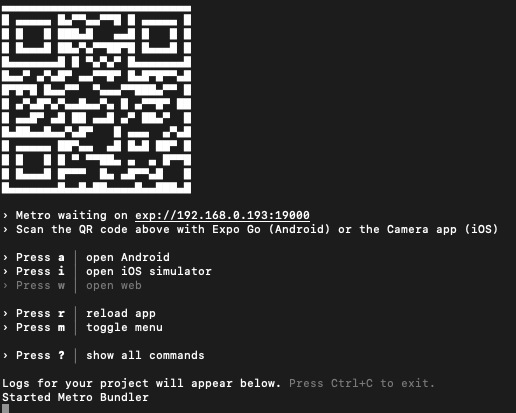

# solomon-task-todo-app
 this is developer demo using react-query for state management

This app is using ExpoGo for faster testing and deployment.

# Testing And Developer setup & Prerequisites:

For device testing, you need to install ExpoGo App:

for iOS: https://apps.apple.com/us/app/expo-go/id982107779

for android: https://play.google.com/store/apps/details?id=host.exp.exponent

To setup the developer view, you need to install the `expo-cli`

`npm install -g expo-cli`

to start expo, you need to install the dependencies:

`yarn install` or `npm install`

to run, simply type:

`expo start`

once started you should be able to see this QR code that you can scan on your device:

example --

to run from your local simulators and emulatrs simply:

› Press a │ open Android

› Press i │ open iOS simulator

› Press w │ open web

*** note that Expo also allows you to view your app from web browser.

# Building Process using Expo & Deployment:

android:
`expo build:android`

ios:
`expo build:ios`

once the commands runs and completed(considering you have credentials for iOS & Google Developer), you shoudl be able to download the .AAB files and .xarchive from Expo.io website to be uploaded to their respective stores.

expo go have their own kind of CI/CD integration that automatically builds your app.

Fast Deployment using Expo Go:
- Fast deployment doesnt build an app package, instead, it'll allow you to use your local device to scan the QR code to run the app like a dev environment.

note: you need to have an expo go account from expo.io. 

`expo upload:android`

`expo upload:ios`

# Technologies used:

`react-query` - I am using this to handle and manage the app states.

`expo` - i'm using this to easily bundle deploy on both iOS (provided we have ios and android credentials) and android and test faster.

